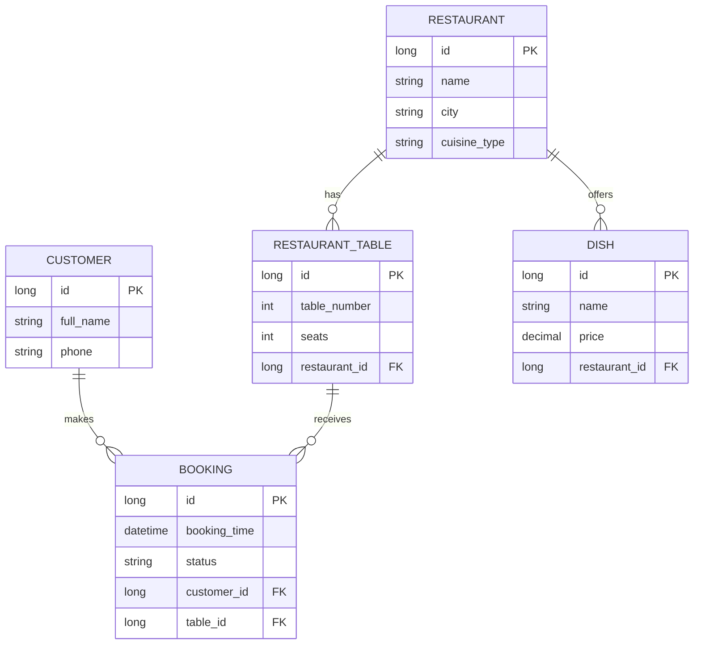

# Restaurant Management System ER Diagram

## Relationship Notes

- `Restaurant (1) -> (N) RestaurantTable`
- `Restaurant (1) -> (N) Dish`
- `Customer (1) -> (N) Booking`
- `RestaurantTable (1) -> (N) Booking`
- `Booking (N) -> (1) Customer`
- `Booking (N) -> (1) RestaurantTable`

## Cascade And Lifecycle

- `Restaurant.tables`: `cascade = ALL`, `orphanRemoval = true`
- `Restaurant.dishes`: `cascade = ALL`, `orphanRemoval = true`
- `RestaurantTable.bookings`: `cascade = ALL`, `orphanRemoval = true`

## Fetch Strategy

- All mapped relations are `LAZY`.
- N+1 demo endpoints intentionally trigger lazy loading.
- Optimized endpoints use `JOIN FETCH` or `EntityGraph`.
