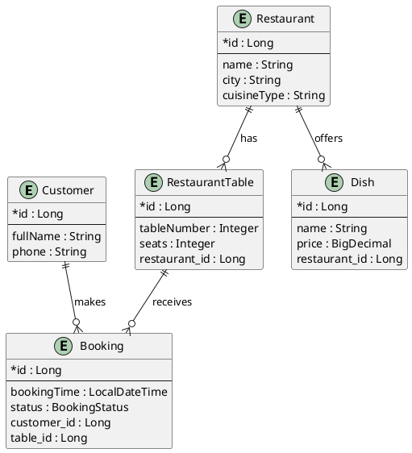

# Restaurant Management System ER Diagram

## Relationship Notes

- `Restaurant (1) -> (N) RestaurantTable`
- `Restaurant (1) -> (N) Dish`
- `Customer (1) -> (N) Booking`
- `RestaurantTable (1) -> (N) Booking`
- `Booking (N) -> (1) Customer`
- `Booking (N) -> (1) RestaurantTable`

## Cascade And Lifecycle

- `Restaurant.tables`: `cascade = ALL`, `orphanRemoval = true`
- `Restaurant.dishes`: `cascade = ALL`, `orphanRemoval = true`
- `RestaurantTable.bookings`: `cascade = ALL`, `orphanRemoval = true`
- `Customer.bookings`: no cascade configured

## Fetch Strategy

- `Restaurant.tables`: `LAZY`
- `Restaurant.dishes`: `LAZY`
- `RestaurantTable.restaurant`: `LAZY`
- `RestaurantTable.bookings`: `LAZY`
- `Dish.restaurant`: `LAZY`
- `Booking.customer`: `LAZY`
- `Booking.table`: `LAZY`
- `Customer.bookings`: `LAZY`

## Project Match

- The diagram matches the current JPA entities in `src/main/java/com/restaurant/app/domain/model`.
- Field names use the same names as the Java model where possible: `fullName`, `cuisineType`, `tableNumber`, `bookingTime`.
- Foreign key columns match the current mappings: `restaurant_id`, `customer_id`, `table_id`.
